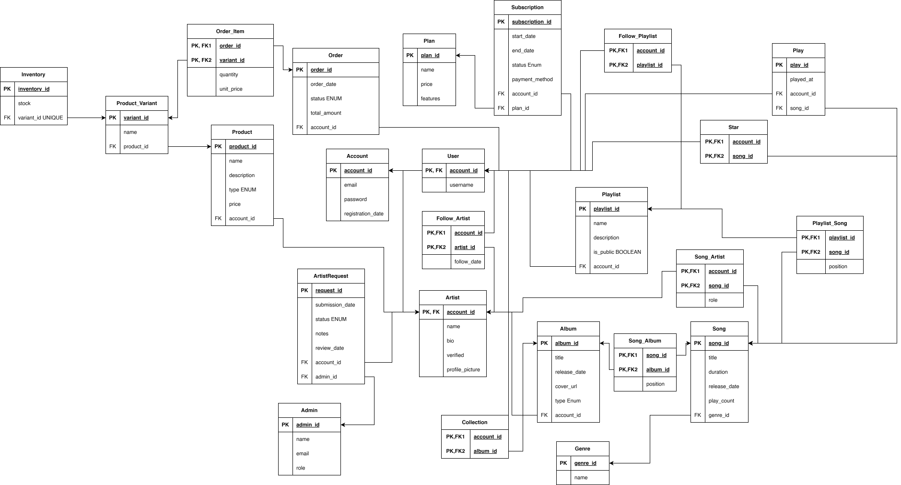

# Analysis

## 1. Chosen organization

**MADM** is a digital music streaming platform built exclusively around artists based in Madrid. Its mission is to give visibility to local talent by creating a curated, closed ecosystem where every piece of content originates from the city. Beyond streaming, MADM connects listeners directly with artists through a built-in store where artists can sell merchandise, physical records, and concert tickets, turning passive listeners into active supporters of the Madrid music scene.

---

## 2. Problem or Need It Solves

Emerging artists in Madrid face a structural visibility problem on global streaming platforms, where algorithmic competition makes it nearly impossible to reach a relevant audience without an already established following.

MADM addresses this by removing that competition entirely. On this platform, the catalog is exclusively Madrid-based, which means every listener is already a potential fan, and every search or recommendation stays within the local scene. Artists do not compete against global acts for attention; they compete on the quality of their music alone.

At the same time, MADM recognises that music alone is not enough to sustain an independent artist. The integrated store allows artists to monetise their identity beyond streams, offering physical products and live experiences directly to their audience without relying on third-party services.

---

## **3. Information It Needs to Manage**

<aside>

### Users and Access

Listener accounts (free and premium), subscriptions, plans, and payments.

</aside>

<aside>

### Music catalog

Artists, albums, songs, genres, collaborations, and release dates.

</aside>

<aside>

### Administration

Validate artists.

</aside>

<aside>

### User Interaction

Play history, star ratings on songs, artist follows, playlist creation and following (premium only), album collections, and personalization preferences.

</aside>

<aside>

### Artist verification

Artist onboarding requests, review status, verification history, and review team management.

</aside>

<aside>

### Artist Store

Products offered by artists (merchandise, physical records, and concert tickets), product variants (sizes, formats, ticket categories), real-time inventory per variant, and order management.

</aside>

---

## 4. Main Processes

**1. Artist registration and verification**
An artist submits an onboarding request through the platform. An MADM administrator reviews the application and verifies Madrid residency. The request is then approved or rejected, with an assigned reviewer.

**2. Content publishing**
Once verified, the artist can upload songs and albums to the platform. All published content becomes immediately available in the catalog for every listener, regardless of their subscription plan.

**3. Music consumption**
Listeners browse and play songs from the catalog, give STARs to tracks, follow artists, and save albums to their personal collection. Every play is recorded individually, generating a full listening history per user.

**4. Subscription and payment management**
Users can upgrade to the premium plan at any time. The system manages the active subscription period, renewal dates, and associated payment records, allowing listeners to downgrade as needed.

**5. Playlist management**
Premium listeners can create their own playlists, add or remove songs, and make them available for other users to follow. Playlist ownership and follower relationships are tracked independently.

**6. Artist store and order management**
Artists can list products in their store, including merchandise, physical records, and concert tickets, each with defined variants and real inventory tracking. Listeners can place orders, which are recorded as individual order lines linked to specific product variants.

---

## **5. User Profiles**

<aside>

### **Free listener**

 Can browse the full catalog, play any song, follow artists, give STARs to tracks, and save albums to their personal collection. No subscription fee required.

</aside>

<aside>

### **Premium listener**

Includes everything available in the free tier, with the addition of playlist creation and management, the ability to follow other users' playlists, and access to personalization features. Requires an active paid subscription.

</aside>

<aside>

### Artist

Holds a separate account from any listener profile. Once verified by the MADM team, can upload songs and albums to the platform, manage their public profile and catalog, and operate their own store to sell merchandise, physical records, and concert tickets.

</aside>

<aside>

### **MADM Administrator**

Internal platform role responsible for reviewing artist onboarding requests, verifying Madrid residency. Manages the verification workflow and maintains the integrity of the platform's artist catalog.

</aside>

# E/R Diagram

Diagrama diseñado con draw.io

# Relational model

Diagrama diseñado con draw.io
